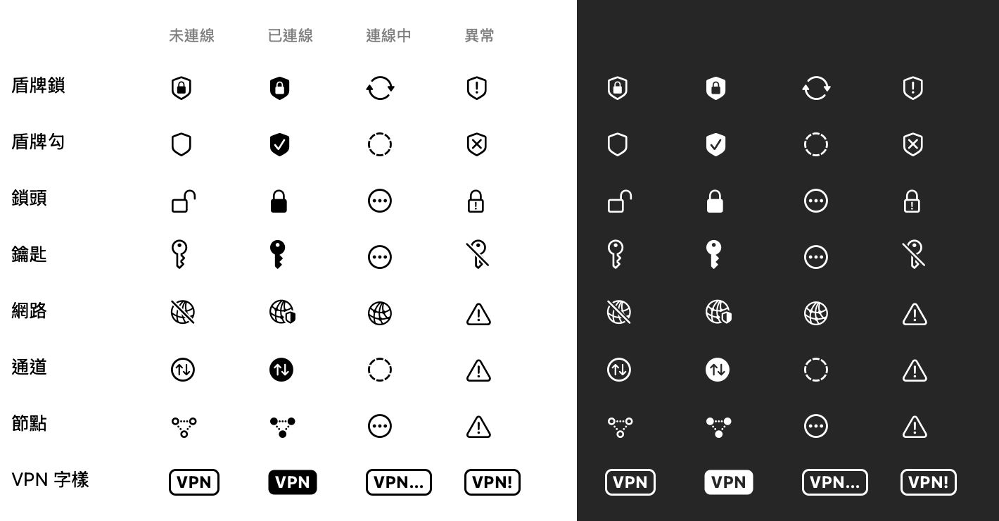

# SplitSwan

macOS 狀態列的 VPN 工具，用開源的 [strongSwan](https://www.strongswan.org) 連 **FortiGate IPsec VPN**（IKEv2、PSK＋EAP 帳密、Mode Config），可以用來取代 FortiClient。

- **Split tunnel**：只有指定網段走 VPN，Teams、Google Meet、一般上網都走原本的網路
- **三台閘道自動輪替**：依過去的連線紀錄，先試最近連得上、連得快的那台；連不上就換下一台
- **自動重連**：睡眠喚醒、切換網路、通道失聯後自動接回；按「斷線」後就不會再自動連線
- **斷線通知**：非預期中斷超過 30 秒時發 macOS 通知，恢復時再通知一次
- **診斷報告**：一鍵產生報告檔給管理者排查，不含密碼與 PSK
- **有圖形介面**：狀態列一鍵連線，主視窗有連線、設定、環境檢查、關於四個分頁，缺的元件可以一鍵安裝
- **公司設定與程式分開**：閘道與網段放在各自電腦的設定檔，原始碼不含任何公司位址

> 版本：1.7.0
>
> **Windows 版（beta）**：托盤 App，透過 WSL2 裡的 strongSwan 連線，功能與介面另有說明，見 [windows/README.md](windows/README.md)；下載請到 Releases 找 `SplitSwan-Windows-x.y.z.zip`。

## 跟 FortiClient 有什麼不同

| | FortiClient（全流量） | SplitSwan（split tunnel） |
|---|---|---|
| 哪些流量走 VPN | 全部（上網、視訊會議都繞去公司） | 只有公司設定檔列出的網段 |
| Teams／Google Meet | 視訊要先繞到公司再出去，延遲高、容易不穩 | 直接走本機網路，不經過 VPN |
| 多台閘道 | 手動切換 | 自動輪替 |

視訊會議的改善是依架構推論：通話流量不再經過 VPN 與公司閘道。實際效果還要看各自的網路環境。

**為什麼 FortiClient 不用設定網段？** 它其實也不知道公司網段，而是把全部流量都送進 VPN，交給公司閘道轉出去。SplitSwan 只讓公司網段走 VPN，所以要列出網段。如果 FortiGate 管理員在閘道上設定了 split tunnel 網段清單，未來可以改成直接採用閘道推送的清單。

## 系統需求

- **Apple Silicon Mac**（Homebrew 裝在 `/opt/homebrew`）。Intel Mac 不支援。
- macOS 14 以上
- [Homebrew](https://brew.sh)
- 公司 VPN 的帳號密碼，以及管理者提供的**加密設定檔**（`.splitswan`，含閘道、網段與預設共享金鑰）和它的**匯入密碼**。

## 安裝（使用者）

### 第一次安裝

先跟管理者拿兩樣東西：**加密設定檔**（`.splitswan`）與它的**匯入密碼**。另外準備好你自己的 VPN 帳號密碼。

1. **安裝 Homebrew**（已經裝過可以跳過）：打開「終端機」，貼上 [brew.sh](https://brew.sh) 首頁的安裝指令並照提示完成。裝好後執行 `brew --version` 有顯示版本就可以了
2. **下載 App**：到 [Releases](https://github.com/mark22013333/SplitSwan/releases/latest) 下載 `SplitSwan-<版本>.dmg`（不要下載 `SplitSwan-Windows-…` 開頭的檔案）
3. **安裝**：打開 dmg，把 SplitSwan 拖進「應用程式」資料夾。之後的一鍵更新需要 App 放在這裡
4. **第一次打開**：到「應用程式」點兩下 SplitSwan。macOS 會跳出「未打開 SplitSwan.app／Apple 無法驗證是否為惡意軟體」，這是因為 App 沒有經過 Apple 公證（只有 ad-hoc 簽章），**只有第一次會出現**。先按「完成」，再擇一處理：
   - 到「系統設定 → 隱私權與安全性」，往下捲到「安全性」，找到 SplitSwan 那一行，按「**仍要打開**」，輸入電腦密碼確認
   - 或在「終端機」執行：`xattr -dr com.apple.quarantine /Applications/SplitSwan.app`，再點兩下 SplitSwan
5. **環境檢查**：App 會開在「環境檢查」分頁，照紅燈由上往下逐項按「安裝」
   - strongSwan：在背景執行 `brew install strongswan`，約 1 分鐘
   - 系統元件：會跳出 macOS 管理員密碼視窗，輸入你的電腦密碼
6. **匯入公司設定**：到「設定」分頁按「**匯入設定檔…**」，選取 `.splitswan` 檔並輸入匯入密碼。閘道、網段與 PSK 會自動帶入，請核對閘道位址後再套用
7. **填帳號密碼**：在「設定」分頁填入你自己的使用者名稱與密碼，按「儲存」
8. **連線**：**先把 FortiClient 斷線**（兩個同時連會衝突），回「連線」分頁按「連線（自動輪替）」。狀態列圖示變成實心盾牌就是連上了
9. 建議順手做：「設定」頁打開「登入時自動啟動」；第一次斷線超過 30 秒時會詢問是否允許通知，請按「允許」

連不上時，到「環境檢查」頁按「產生診斷報告」，把桌面上的報告檔傳給管理者。連上了但某台公司主機打不開，見「[某台主機連不上怎麼辦](#某台主機連不上怎麼辦)」。

### 之後更新

- **1.7.0 以後**：「關於」頁按「檢查更新」，有新版本時按「下載並安裝」，App 會驗證簽章後自動替換並重新開啟，VPN 不會斷線，也不會再出現上面第 4 步的警告。想要自動提醒，可以勾選「每天自動檢查更新」（預設不勾選，不會自動安裝）
- **1.6.x 以前**：沒有一鍵更新，請照上面第 2～4 步手動下載安裝一次 1.7.0 以後的版本，設定會保留
- 如果新版有更新系統元件，「環境檢查」會顯示「需要更新」，按「更新」並輸入電腦密碼即可

### 使用

- 狀態列圖示：空心盾牌＝未連線、實心盾牌＝已連線、循環箭頭＝連線中、驚嘆號盾牌＝環境沒設好（點圖示選「開啟 SplitSwan 視窗」看環境檢查）
- 點狀態列圖示可以直接連線、斷線，或指定連 VPN1／VPN2／VPN3。每台閘道後面會顯示最近狀態，例如「上次 3.2 秒連上」「最近 3 次失敗」
- 自動輪替的順序：10 分鐘內失敗過的閘道排最後，上次成功的排第一，其餘依成功率與連線速度。「設定」頁可以「清除閘道連線紀錄」，恢復設定的順序
- 斷線通知：第一次需要時會詢問是否允許通知，請按「允許」。可以在「設定」頁關閉「VPN 中斷時通知」。手動斷線、睡眠喚醒後 30 秒內自動接回的情況不會通知
- 關掉視窗 App 會繼續在狀態列執行。要完全結束，從狀態列選「結束 SplitSwan」
- 連線紀錄：「連線」頁下方可展開，顯示 strongSwan 的協商過程與 App 的動作（連線、重試、重建通道），可拷貝給管理者
- 診斷報告：「環境檢查」頁按「產生診斷報告」，約數秒後在桌面產生 `SplitSwan-診斷-<時間>.txt` 並在 Finder 中選取，不會中斷連線。報告不含密碼與 PSK，但含閘道位址與通道網段，只傳給管理者
- 開機自動啟動：「設定」頁打開「登入時自動啟動」
- 版本與更新：「關於」頁顯示目前版本，可以拷貝版本資訊（回報問題時附上），按「檢查更新」會查 GitHub 上的最新版本。有新版本時按「下載並安裝」：App 會下載、驗證發布者的數位簽章，再取代目前的 App 並重新開啟，VPN 連線不會中斷；簽章不符就不安裝。勾選「每天自動檢查更新」（預設不勾選）會每天檢查一次，有新版本時顯示在狀態列選單，但不會自動安裝。App 要放在「應用程式」資料夾才能一鍵更新
- 輸入框支援 ⌘C／⌘V／⌘A；設定頁可用 ⌘S 儲存
- 狀態列圖示有 8 種樣式可選（「設定」頁的「狀態列圖示」），也可以設定已連線時顯示綠色：

  

## 公司設定檔（管理者）

閘道與通道網段不寫在程式裡，放在每台電腦的 `~/.config/splitswan/company.env`。管理者製作一份交給同事匯入即可。

### 建議：匯出加密設定檔

在自己已經設定好的 App 上，到「設定」頁按「**匯出加密設定檔…**」：

- 內容：閘道、通道網段、預設共享金鑰（PSK）。**不含**你個人的帳號密碼。
- 匯出時自訂一組密碼（至少 8 個字元）。檔案用 AES-256-GCM 加密，金鑰由密碼經 PBKDF2-SHA256（600,000 次）衍生；檔案被修改過就解不開。
- **把檔案與密碼分開傳送**（例：檔案用 email、密碼用 Teams 口頭告知），就算檔案外流也解不開。
- 同事按「匯入設定檔…」選取檔案、輸入密碼，App 會列出閘道與網段讓他確認，按「套用」才寫入。

### 也可以用明文的 company.env


1. 複製範本 [`config/company.env.example`](config/company.env.example) 成 `company.env`，填入實際值：
   ```bash
   SPLITSWAN_PRESET_NAME="我的公司"                         # 顯示在設定頁（選填）
   SPLITSWAN_GATEWAYS="203.0.113.10,203.0.113.20,203.0.113.30"   # 最多 3 台，逗號分隔
   SPLITSWAN_REMOTE_TS="10.0.0.0/24,198.51.100.5/32"           # 要走 VPN 的網段；單一主機寫 IP/32
   ```
2. 透過公司內部管道**私下**傳給同事（含公司位址，不要放進任何公開的地方）
3. 同事在「設定」頁按「匯入公司設定檔…」。App 會先驗證格式，通過後複製到 `~/.config/splitswan/company.env`（權限 600）。

App 取得閘道與網段的順序：

1. App 已儲存的設定
2. 既有的 strongSwan 設定檔（`/opt/homebrew/etc/swanctl/swanctl.conf`）
3. 公司設定檔 `~/.config/splitswan/company.env`
4. 環境變數 `SPLITSWAN_GATEWAYS`、`SPLITSWAN_REMOTE_TS`（只有從終端機啟動 App 時才讀得到，見下方說明）
5. 以上都沒有：留空，由使用者在設定頁自己填

「設定」頁的「從公司設定還原」會重新套用公司設定檔的值。改錯了，可以用它復原。

**關於 `~/.zshrc`**：從 Finder、Dock 或登入項目開啟的 macOS App 不會載入 `~/.zshrc`，所以 App 以公司設定檔為準。如果想讓終端機工具也用同一組值，可以在 `~/.zshrc` 加上：

```bash
[ -f ~/.config/splitswan/company.env ] && set -a && source ~/.config/splitswan/company.env && set +a
```

## 某台主機連不上怎麼辦

多半是那台主機不在通道網段裡，流量沒有走 VPN。

### 一鍵檢查（建議）

「設定」頁的「通道網段」卡片下方有「某台公司主機連不上？」：

1. 輸入主機網域、IP、`主機:連接埠`或整段網址（例如 `https://intranet.example.com:8443/page`），按「檢查」
2. App 用系統 DNS 查出 IPv4。已經在通道網段內的會直接進入驗證；不在網段內的會列出預計新增的 `IP/32` 讓你確認。查到公網 IP 時會多一段警告（可能是 DNS 沒走公司端）
3. 按「加入並重新連線」：儲存設定、斷線重連（目前連線會中斷幾秒），再檢查每個 IP 的路由是否走 `utun`；有填連接埠會一併測試 TCP 能否連線
4. 走 VPN 了還是不通：按「複製結果」，把內容（主機、IP、連接埠、路由與測試結果）傳給管理者，確認公司端有沒有開放。如果是全公司都需要的主機，請管理者加進 `company.env` 重新發給大家

設定表單有還沒儲存的修改時，一鍵加入會先擋下，請先按「儲存」或「還原」。

### 手動步驟

一鍵檢查失敗時，可以照下面步驟自己加（同樣的步驟也收在設定頁的「手動排查步驟」）：

1. **查出主機的 IP**：`dig +short 主機網域`
2. **加進通道網段**：「設定」頁通道網段加一行 `<IP>/32`（單一主機）或 `<網段>/24`，按「儲存」
3. **斷線再重新連線**。新網段要重新連線才會生效。
4. **確認有走 VPN**：`route -n get <IP>`，interface 那一行應該是 `utun` 開頭；是 `en0` 就代表沒走 VPN
5. 走 VPN 了還是不通：把 IP 和連接埠告訴管理者，確認公司端有沒有開放。

注意事項：
- **不要把通道網段改成 `0.0.0.0/0`**（全部流量走 VPN）。在 macOS 上這樣會讓一般上網的 DNS 解析失敗，外網會全斷（見「已知問題」）。
- 雲端 VM 的公用 IP 如果是動態的，重開機後可能會變。原本能連、突然不能連時，先用步驟 1 確認 IP 有沒有變。
- 如果本機網段（例如家裡路由器的網段）跟公司網段重疊，會互相衝突。

## 疑難排解

| 狀況 | 處理方式 |
|------|----------|
| 圖示一直是驚嘆號盾牌 | 開視窗到「環境檢查」，把紅燈逐項按「安裝」 |
| 環境檢查顯示「尚未設定閘道或通道網段」 | 「設定」頁按「匯入公司設定檔…」 |
| 三台閘道都連不上 | 到「環境檢查」頁按「產生診斷報告」，把桌面上的報告檔傳給管理者；也可以展開「連線」頁下方的「連線紀錄」看卡在哪一步。最常見的是密碼或 PSK 打錯（報告的 charon log 會出現 `AUTHENTICATION_FAILURE`），或 FortiClient 還連著 |
| 沒有收到斷線通知 | 到「系統設定 → 通知 → SplitSwan」確認允許通知；「設定」頁的「VPN 中斷時通知」要打開 |
| 連上後某台主機不通 | 見「某台主機連不上怎麼辦」 |
| 連上後外網全斷 | 通道網段被改成 `0.0.0.0/0` 了，按「從公司設定還原」 |
| 系統元件顯示「需要更新」 | 更新 App 後內附的元件可能跟著更新，按「更新」重新授權一次 |
| 診斷報告顯示「找不到 log 檔」 | 系統元件是舊版，到「環境檢查」按「更新」，再重新連線一次，之後的連線過程才會寫進 log |
| 存檔時顯示格式錯誤 | 訊息會指出是哪個欄位；網段要寫成 `a.b.c.d/遮罩`，用半形數字，不可用 `/0` |

## 解除安裝

```bash
sudo rm /etc/sudoers.d/splitswan /usr/local/libexec/splitswan-helper
rm -f /opt/homebrew/etc/strongswan.d/splitswan.conf
sudo rm -r /var/log/splitswan
rm -r /Applications/SplitSwan.app ~/.config/splitswan
brew uninstall strongswan
# 確認 /opt/homebrew/etc/swanctl 是否還在；裡面有密碼檔，不需要的話手動刪除
```

如果開過「登入時自動啟動」，先在設定頁關掉，或到「系統設定 → 一般 → 登入項目」移除。

---

## 開發

### 編譯與打包

需求：Xcode Command Line Tools（Swift 6.1 以上）。

```bash
bash build.sh             # 編譯到 build/SplitSwan.app
bash build.sh --install   # 編譯並安裝到 /Applications（會先結束正在執行的 App）
bash make-dmg.sh          # 編譯並打包成 dist/SplitSwan-<版本>.dmg
```

- 版本號在 `build.sh` 開頭的 `VERSION`、`BUILD_NUM`。
- 單元測試：`bash Tests/run-tests.sh`（不連 VPN、不需要 sudo、不寫入系統設定）。涵蓋自動重連、斷線通知判定、閘道排序、加密匯出入、注入攻擊回歸測試、網段格式轉換、診斷報告的密碼遮蔽、檢查更新的版本比較、一鍵更新的簽章驗證與替換流程。
- 輔助程式 `logtrim` 的截斷測試：`bash tools/test-logtrim.sh`（一般權限，在暫存目錄操作副本）。
- 自動重連的實機測試：`sudo bash tools/test-dpd.sh`（暫時封鎖閘道，量失聯偵測與恢復秒數；斷線通知要在測試期間人工確認），驗收清單與結果見 [`docs/F1-實機驗收.md`](docs/F1-實機驗收.md)。
- 開發時可以用 `open build/SplitSwan.app --args -InitialTab settings`（或 `environment`、`about`），直接開在指定分頁。

### 改名

App 顯示名稱與 bundle id 在 [`app.env`](app.env)，改完重新編譯即可。Swift 程式從 `Info.plist` 讀名稱，不用改程式碼。

改 bundle id 之後，App 存的設定與登入項目會重新開始，strongSwan 設定檔與公司設定檔不受影響。

下列是內部識別字，改名時**不一定要改**；要改的話請一併修改：

| 識別字 | 出現位置 |
|--------|----------|
| 輔助程式 `/usr/local/libexec/splitswan-helper` | `splitswan-helper`、`install-root.sh`、`Sources/VPNController.swift`、`Sources/EnvChecker.swift`、`diag.sh`、`build.sh` |
| sudoers 規則 `/etc/sudoers.d/splitswan` | `install-root.sh` |
| charon log `/var/log/splitswan/charon.log` | `splitswan-helper`、`install-root.sh`、`Sources/ConfigStore.swift`、`Sources/DiagnosticRunner.swift` |
| 公司設定檔 `~/.config/splitswan/company.env` | `Sources/CompanyPreset.swift` |
| 環境變數前綴 `SPLITSWAN_` | `Sources/CompanyPreset.swift`、`config/company.env.example` |

### 架構

```
SplitSwan.app（狀態列＋主視窗，一般使用者權限）
   │  ├─ 讀 ~/.config/splitswan/company.env（公司設定）
   │  ├─ 直接讀寫 /opt/homebrew/etc/swanctl/{swanctl.conf, conf.d/secrets.conf}
   │  ├─ 直接寫 /opt/homebrew/etc/strongswan.d/splitswan.conf（重送參數與 filelog）
   │  ├─ 直接讀 /var/log/splitswan/charon.log（診斷報告用）
   │  └─ sudo -n（sudoers 只對這一支程式免密碼）
   ▼
/usr/local/libexec/splitswan-helper（root 擁有的輔助程式，只接受固定幾種參數）
   │
   ▼
swanctl ──vici──▶ charon（strongSwan daemon，root）──IKEv2──▶ FortiGate
```

- App 本身不碰 root 權限，需要 root 的動作都集中在輔助程式裡。它只接受 `status`、`up [auto|1|2|3]`、`down`、`reload`、`reload-settings`、`log`、`sas`、`logtrim`，其他參數一律拒絕。
- 設定檔放在使用者可寫入的目錄，App 直接寫入，存檔後呼叫 `reload` 讓 charon 重新載入。已經連著的通道不受影響，下次連線才套用。重送參數與 log 設定改變時另外呼叫 `reload-settings`。
- charon 的 log 寫到 `/var/log/splitswan/charon.log`（等級 1，不含金鑰）。目錄由 `install-root.sh` 建立並歸 root 所有；檔案沒有輪替功能，改由輔助程式 `logtrim` 在每次連線前與每小時檢查，超過 2 MB 時就地截斷成最後 1 MB。
- 系統元件的安裝腳本內附在 App 裡（`Contents/Resources/install-root.sh`），由「環境檢查」頁透過 macOS 管理員授權執行。App 會比對已安裝的輔助程式與內附版本，不同就顯示「需要更新」。

### VPN 參數

| 項目 | 值 |
|------|----|
| 協定 | IPsec IKEv2，Mode Config |
| 驗證 | 閘道用預設共享金鑰（PSK），使用者用 EAP 帳密 |
| Phase 1 | AES128／AES256 + SHA256，DH 20（ecp384），金鑰有效期 86400 秒，開啟 DPD |
| Phase 2 | AES128／AES256 + SHA256，金鑰有效期 43200 秒；同時接受有／無 PFS |

這組參數對應 FortiClient「IPsec VPN」連線的常見設定，寫在 `Sources/ConfigStore.swift` 的 `renderConf`。如果你的 FortiGate 用不同的加密參數，要改這裡。

### 檔案說明

| 檔案 | 用途 |
|------|------|
| `app.env` | App 名稱與 bundle id |
| `Sources/main.swift` | 程式進入點、狀態列選單、視窗管理 |
| `Sources/MainView.swift` | 主視窗四個分頁（SwiftUI） |
| `Sources/VPNController.swift` | 呼叫輔助程式、定時更新連線狀態、自動重連、斷線通知判定 |
| `Sources/DropNotifier.swift` | 發送 macOS 斷線／恢復通知 |
| `Sources/GatewayHistory.swift` | 閘道連線紀錄與自動輪替排序 |
| `Sources/DiagnosticReport.swift` | 診斷報告的組字與密碼遮蔽（純函式） |
| `Sources/DiagnosticRunner.swift` | 收集診斷資料（限時執行外部指令）並寫出報告 |
| `Sources/ConfigStore.swift` | 產生與讀取 swanctl.conf、secrets.conf；驗證輸入 |
| `Sources/CompanyPreset.swift` | 讀取與匯入公司設定檔、環境變數 |
| `Sources/ConfigExport.swift` | 加密設定檔（`.splitswan`）的匯出與匯入 |
| `Sources/MenuBarIcon.swift` | 狀態列圖示的 8 種樣式 |
| `Sources/EnvChecker.swift` | 環境檢查與一鍵安裝 |
| `Sources/AppInfo.swift` | 從 Info.plist 讀 App 名稱與版本；GitHub repo 位址 |
| `Sources/AboutInfo.swift` | 「關於」頁的版本資訊與檢查更新（版本比較、解析 GitHub 回應） |
| `Sources/UpdateCenter.swift`、`UpdateInstaller.swift`、`UpdateLogic.swift` | 一鍵更新與每日自動檢查：下載、Ed25519 簽章驗證、檢查與替換 App |
| `tools/release-sign.swift` | 發版時簽署 dmg（私鑰不在 repo） |
| `tools/make-icon.swift` | 產生 App 圖示 |
| `tools/test-dpd.sh` | 實機測試自動重連：暫時封鎖閘道，量失聯偵測與恢復秒數（需 sudo） |
| `tools/test-logtrim.sh` | 測試輔助程式的 `logtrim` 截斷（一般權限，使用副本） |
| `build.sh` | 編譯、產生圖示、內附系統元件、ad-hoc 簽章 |
| `make-dmg.sh` | 打包 .dmg |
| `splitswan-helper` | root 輔助程式 |
| `install-root.sh` | 安裝輔助程式、sudoers 規則與 log 目錄（App 內附，也可以手動 `sudo bash install-root.sh`） |
| `vpn.sh` | 命令列版本（每次會要求輸入 sudo 密碼） |
| `diag.sh` | 連線診斷：自動連線、收集路由／DNS／SA，測試通道網段內的目標與外網，再自動斷線 |
| `config/company.env.example` | 公司設定檔範本 |
| `config/secrets.conf.example` | strongSwan 密碼檔範本（參考用，App 會自動產生） |

### 安全

- **PSK 與密碼只存在 `/opt/homebrew/etc/swanctl/conf.d/secrets.conf`**（權限 600），公司位址只存在 `~/.config/splitswan/company.env`（權限 600），兩者都不在 repo 裡。
- 加密設定檔的安全性取決於匯出密碼的強度，請用不容易猜到的密碼，並與檔案分開傳送。
- **加密只保密，不證明來源**：有人可以自己做一份 `.splitswan`，把閘道換成他的主機，再連同密碼騙你匯入，你的 VPN 帳號密碼就會送過去。所以匯入時 App 會列出閘道與網段要你確認；**只匯入管理者親自給的檔案**，並核對閘道位址。
- 匯入的內容一律嚴格驗證（閘道最多 3 台、只接受 IP／網域字元、網段逐筆檢查、拒絕 `/0` 與控制字元），`company.env` 一律由驗證後的值重新產生，值用單引號包住，被 shell `source` 時不會執行任何內容。
- App 的設定頁不會顯示已存的密碼，欄位留空代表沿用原本的值。
- 診斷報告寫入前會遮蔽密碼與 PSK：先用規則把 `secret`、`password`、`PSK`、`EAP` 等欄位的值換成 `***`，再把目前設定中 6 個字元以上的實際密碼與 PSK 精確取代。報告檔權限 600，但含閘道位址與通道網段，只傳給管理者。
- charon log 等級固定為 1（基本控制訊息），不含金鑰。log 檔權限 644，本機其他帳號也能讀到連線過程與閘道位址。
- 輸入會先驗證再寫入：帳號、閘道、網段只接受固定字元，避免換行、大括號等字元破壞設定檔結構；密碼與 PSK 會跳脫雙引號與反斜線。匯入的公司設定檔也用同一套規則驗證。
- 免密碼 sudo 只放行 `/usr/local/libexec/splitswan-helper`。它是 root 擁有，一般使用者改不了。
- 已知限制：Homebrew 安裝的 `charon`、`swanctl` 放在一般使用者可寫入的 `/opt/homebrew` 底下，被替換的話仍然能透過輔助程式取得 root。`/opt/homebrew/etc/strongswan.d/` 同樣可由一般使用者寫入，有心人可以改掉 filelog 路徑，讓以 root 執行的 charon 寫入任意檔案。改用每次輸入密碼也有同樣的風險，差別只在於需要使用者當下在場輸入。

### 已知問題

1. **全流量模式（`0.0.0.0/0`）下 DNS 失敗**（未解決）
   - 連線本身正常，直接問 DNS 伺服器（`dig @<DNS>`）也正常，但 macOS 系統解析失敗，curl 顯示「Resolving timed out」。
   - 差異在於 strongSwan 把 DNS 加到 Wi-Fi（`en0`）的設定裡，讓系統解析綁在 `en0` 送出；FortiClient 則是綁在自己的 VPN 介面上。綁在 `en0` 為什麼會失敗，還沒查清楚。
   - 已排除的原因：閘道擋外網（同一個閘道用 FortiClient 全流量時外網正常）、MTU（VPN 下不可切割的封包一路通到 1400 bytes）。
2. **登入時自動啟動是否會跳視窗**（待確認）：App 用 Apple Event 判斷是不是登入時啟動，這對 `SMAppService` 註冊的登入項目是否有效還沒實測。就算跳出來，關掉視窗即可。

## 授權

[MIT](LICENSE)。

SplitSwan 以獨立程序呼叫 [strongSwan](https://www.strongswan.org)（GPLv2），沒有連結或散布它的程式碼；strongSwan 由使用者自行透過 Homebrew 安裝。FortiGate、FortiClient 是 Fortinet 的商標，本專案與 Fortinet 無關。
